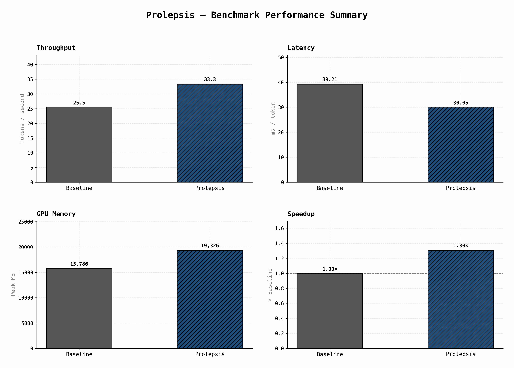

# Prolepsis

[](https://opensource.org/licenses/MIT)
[](https://www.python.org/)
[](https://github.com/iamrahulreddy/Prolepsis/actions)

**An accessible implementation of Speculative Decoding (Leviathan et al.) that accelerates LLM inference while perfectly preserving the original model's output distribution.**

## Why "Prolepsis"?

The name comes from the Greek rhetorical device **prólepsis** (πρόληψις) — literally *"anticipation."* In classical rhetoric, prolepsis means addressing or answering something *before* it has been stated. In speculative decoding, a small draft model does exactly this: it *anticipates* the tokens the larger model would produce, getting ahead of the sequential bottleneck. The name captures the core mechanism — prediction before verification.

## Overview

In standard language model inference, memory bandwidth frequently becomes an overriding bottleneck because massive weight matrices must be sequentially loaded into SRAM for every single token generated. 

Prolepsis accelerates inference by introducing a smaller, faster **draft model** to predict a sequence of future tokens ($\gamma$). The larger, slower **target model** then verifies all of these drafted tokens simultaneously in a single parallel forward pass.

To ensure the final output reflects the large target model flawlessly (meaning zero degradation in linguistic quality or reasoning capability), Prolepsis leverages a modified rejection sampling algorithm. This ensures the output sequence perfectly aligns with the target distribution over time, while dramatically compressing wall-clock generation latency.

## Performance

By successfully predicting tokens ahead of the autoregressive bottleneck, latency is noticeably reduced. The following findings highlight the performance characteristics of pairing a highly capable small draft architecture with a larger foundation model:

### Mixed Prompts Cloud Evaluation (NVIDIA A100 40GB)

| Model Pair | Baseline Latency | Speculative Latency | Speedup | Acceptance Rate |
|------------|------------------|---------------------|---------|-----------------|
| Qwen3 1.7B → 8B | ~39.2 ms/tok | ~30.1 ms/tok | **~1.30x** | **~56.5%** |

*(60 mixed-domain prompts, 1024 output tokens, γ=5, temperature=0.6. Synthetic benchmarks and repetitive tasks frequently yield >2.5x speedups, but these metrics favor realistic mixed workloads).*

### Benchmark Dashboard
Below is an automated telemetry export from the Prolepsis benchmark visualizer:



## Quick Start

### 1. Environment Setup

Prolepsis is designed to integrate natively into standard PyTorch and Hugging Face `transformers` deployments.

```bash
# Clone the repository
git clone https://github.com/iamrahulreddy/Prolepsis.git
cd Prolepsis

# Install core dependencies (use .[quantization] to include bitsandbytes)
pip install -e .
```

### 2. Basic Inference

```python
from prolepsis import SpeculativeDecoder, SpeculativeConfig

# 1. Configure the model pair and sampling parameters
config = SpeculativeConfig(
    draft_model_name="Qwen/Qwen3-1.7B",
    target_model_name="Qwen/Qwen3-8B",
    gamma=5,               # Number of draft tokens to guess per step
    temperature=0.6,       # Generation nuclei temperature
    max_new_tokens=128,
)

# 2. Models are loaded and paired automatically
decoder = SpeculativeDecoder(config)

# 3. Generate mathematically exact sequences rapidly
output = decoder.generate("Explain quantum computing in one paragraph.")
print(output)
```

## Benchmarking Suite

An automated harness is provided out-of-the-box to rigorously compare generation strategies:
1. Standard autoregressive baseline
2. Prolepsis speculative decoding
3. Hugging Face's built-in `assisted_generation`

```bash
# Execute the comprehensive benchmarking suite
make benchmark
```

To run the python pipeline directly for custom debugging scenarios:
```bash
python benchmark/run_benchmark.py \
    --draft-model Qwen/Qwen3-1.7B \
    --target-model Qwen/Qwen3-8B \
    --num-prompts 60 \
    --prompt-file robust_prompts.json \
    --visualize \
    --detailed-plots
```

## Architecture & Theory

The internal project architecture adheres to strict separation of concerns, ensuring core mathematical evaluation remains unpolluted by model caching logic.

- **State Managers**: The `DualKVCacheManager` natively handles truncating the KV cache when drafted tokens are rejected, eliminating destructive deep copies.
- **Compute Logic**: The `rejection_sampler.py` implements the requisite probability math using vectorized, batched PyTorch tensor operations.
- **Wrapper Interface**: Models are wrapped via a unified subclass framework, ensuring Prolepsis functions effectively across standard Hugging Face model architectures.

**For a systematic breakdown of the underlying equations and caching models, please refer to the [Algorithm Documentation](docs/ALGORITHM.md) and [Architecture Guide](docs/ARCHITECTURE.md).**

## 🛣️ Limitations & Future Roadmap

While this implementation guarantees mathematically exact reproduction, there are known engineering and evaluation constraints slated for future iterations:

- **Python GPU Synchronization**: The default `RejectionSampler` relies on pure PyTorch tensor masks. To dynamically slice rejected tokens, PyTorch fundamentally forces a CPU-to-GPU synchronization. This latency overhead is an unavoidable characteristic of Python-level dynamic tensor allocation, which is why the fused `verify_kernel.py` Triton extension is provided for environments demanding peak throughput.
- **Evaluation Scale**: Current benchmarks are executed over a curated suite of 60 prompts across varying domains utilizing a single execution run (`runs=1`), strictly due to hardware compute constraints. Future work will expand this evaluation telemetry across considerably larger, multi-turn datasets rigorously averaged over multiple runs to establish definitively stable latency distributions.

## Citation

If this implementation or its optimization strategies inform your own research or engineering efforts, citation via the included metadata is appreciated.

```bibtex
@misc{prolepsis2026,
  author = {Muskula, Rahul},
  title = {Prolepsis: Exact Output Speculative Decoding for LLMs},
  year = {2026},
  publisher = {GitHub},
  journal = {GitHub repository},
  howpublished = {\url{https://github.com/iamrahulreddy/Prolepsis}}
}
```
